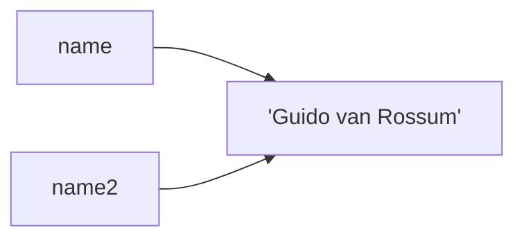
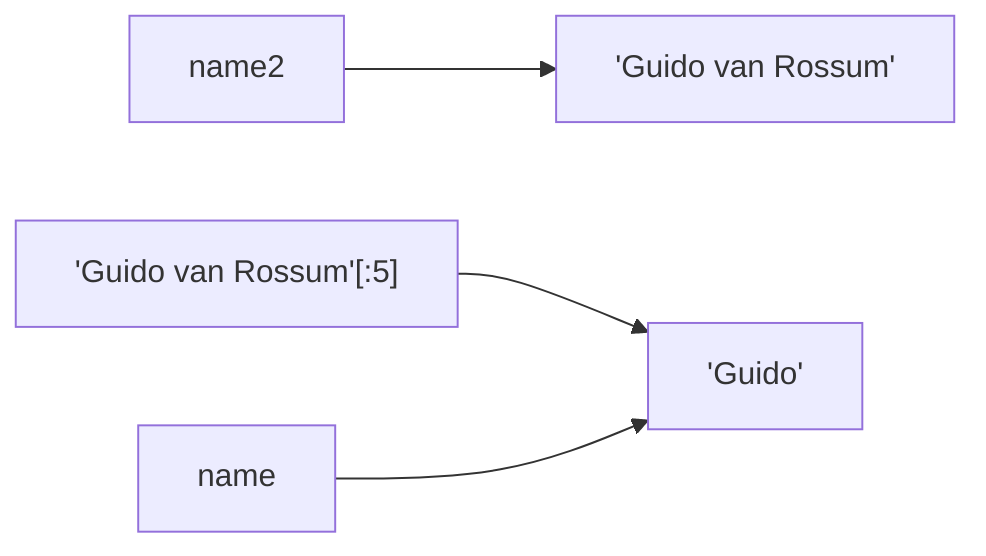

# Workshop 05 - Understanding Sequential Data

For this workshop, we will first play a game and then visualize the memory structure being sequential data.

> **Sequential Data**  
> In python Lists, Tuples, Strings, Sets are ordered sequential data, meaning they are hold multiple pieces of information
> together in an ordered sequence. For Strings it is a bunch of single characters together. For Lists it is any type in a mutable manner, for tuples it is any type in an immutable manner, and for sets it is unique value of types in an immutable manner. 

## Wheel of Fortune / Hang'um

Wheel of Fortune and Hangman share a similar premise. You are guessing a word or phrase, based on guessing letters. 

As a group, have one person be the 'host' and others take turns guessing letters in the phrase the host decides. As the host 
you should also include spaces as a character. For example, if my phrase was [Guido van Rossum](https://en.wikipedia.org/wiki/History_of_Python)

I would draw:

| _ | _ | _ | _ | _ | _ | _ | _ | _ | _ | _ | _ | _ | _ | _ | _ |
|:-:|:-:|:-:|:-:|:-:|:-:|:-:|:-:|:-:|:-:|:-:|:-:|:-:|:-:|:-:|:-:|

which would then match
| _ | _ | _ | _ | _ | _ | _ | _ | _ | _ | _ | _ | _ | _ | _ | _ |
|:-:|:-:|:-:|:-:|:-:|:-:|:-:|:-:|:-:|:-:|:-:|:-:|:-:|:-:|:-:|:-:|
| G | u | i | d | o |   | v | a | n |   | R | o | s | s | u | m |

### Adding Numbers

Now after playing a couple games, you should add numbers to the bottom! However, we are computing scientists, so we start counting at 0.

| _ | _ | _ | _ | _ | _ | _ | _ | _ | _ | _ | _ | _ | _ | _ | _ |
|:-:|:-:|:-:|:-:|:-:|:-:|:-:|:-:|:-:|:-:|:-:|:-:|:-:|:-:|:-:|:-:|
| 0 | 1 | 2 | 3 | 4 | 5 | 6 | 7 | 8 | 9 | 10 | 11 | 12 | 13 | 14 | 15 |

which would then turn into

| _ | _ | _ | _ | _ | _ | _ | _ | _ | _ | _ | _ | _ | _ | _ | _ |
|:-:|:-:|:-:|:-:|:-:|:-:|:-:|:-:|:-:|:-:|:-:|:-:|:-:|:-:|:-:|:-:|
| G | u | i | d | o |   | v | a | n |   | R | o | s | s | u | m |
| 0 | 1 | 2 | 3 | 4 | 5 | 6 | 7 | 8 | 9 | 10 | 11 | 12 | 13 | 14 | 15 |


> Essentially, you have been thinking of strings as sequential data every time you play these games growing up!

### Try it in python

Let's try it in python. All sequential data shares some similar functions and operations. 


```python
creator = "Guido van Rossum"
length = len(creator)
print(f"Q1: {length}")
```
Q1 - what is printed? Discuss and then run the code to see.

```python
creator = "Guido van Rossum"
first = creator[:5]
length = len(first)

print((first, length))
```

Q2 - what is printed? Talk about the length, is the 5 "inclusive" or "exclusive" of 5? What is the value before the `:` it is assumed. 

```python
creator = "Guido van Rossum"
first = creator[:creator.find(' ')]
length = len(first)

print((first, length))
```

Q3 - would this print the same thing as the Q2? You may want to look up to see what the find method does!

Q4 - What is better if you want to have the names be variable length? What if the name changed to Barbara Liskov, which method would still work without modification? 

> [Barabara Liskov](https://en.wikipedia.org/wiki/Barbara_Liskov) is a famous computer scientist who invented the [Liskov Substitution Principle](https://en.wikipedia.org/wiki/Barbara_Liskov) even though she didn't directly name it that. This is something
> we will discuss later in the course when we get to objects, but really it is covered in 5004 when you talk about
> inheritance. Without her, programming languages would be a lot less useful!


## Pattern Matching
Often when we look at data, we are looking at patterns. We will explore this concept more with file formats, but let's think about strings.


Given the following strings

```python
neu_boston = "Boston,42.3395683,-71.0922272"
neu_sanfran = "San Francisco,37.79292,-122.4068792"
neu_vancouver = "Vancouver,49.2806832,-123.1178707"
```

Can you see a pattern? 

> PLACE,LATITUDE,LONGITUDE 

Write a 2 functions. One that reads in a string with that pattern, and returns the location name. The second function reads in that string and returns a tuple of Latitude and Longitude.

Later when we deal with files, you could load a file with 100 such strings, but your functions would still work. They care more about the pattern, than the values themselves!

If you look at [code.py](code.py), you will see an example that uses a while loop instead of three variables. Discuss the code in `show_pattern()`. 


### Further Thinking
Most file formats are patterns that follow a specific format! HTML parsing involves looking for the HTML tags 

```html
<h1>heading</h1>
<p>This is a paragraph about heading</p>
```

Because HTML files have a known "pattern" (called format), we can write code to parse and display the information in a different way. This is also true of the markdown files you have been creating. There is a pattern to the format, that can be "exploited" to create a different output.


## Visualizing Data

It is important to visualize your code. [Python Tutor] is a tool that can help with that!  

* View the [visualization for code.py]. Hint right click to open in a new tab. 

* For this next section, you will want to open [Python Tutor] in a new tab, as some of the examples will make more sense if you can see the code and the visualization at the same time. 

## Mutable vs Immutable

In most programming languages, there are two types of data, mutable and immutable. Mutable means that the data can be changed, immutable means that it cannot be changed. These concepts exist to help both with memory management, and with understanding how data is stored.

### Immutable Data
So far you have mostly been working with immutable data. Strings and Numbers are all immutable, which means once they are created in memory, they can't be directly changed.  You can create new strings and numbers, but you can't change the old ones.  Let's look at an example for string. 


```python
name = "Guido van Rossum"
name2 = name 
name = name[:5]
```

Memory wise, name[:5] is actually creating another string, and returning it. It is not changing the original string. You then set the variable name to point to the new string.


But then in the second line, you are creating a new string, and setting name to point to that new string. 



Here is the [visualization for the name code]. If you write it yourself into python tutor yourself, make sure you use the drop down for "render all objects on the heap (Python/Java)". We will cover the heap and stack in more detail later, but for now know it is where more complex data is stored such as strings, lists, tuples and more.   


Discuss: What are some questions? Make sure you all see the visualization and discuss.

### Adding Another Immutable Type - Tuples

Tuples are another immutable type in python. They are a sequence of items, that once that sequence is set, it can't be changed.  In IDLE run the following code (it will error if done right)

```python
my_tuple = ("goat", "tiger", "dragon")
print(my_tuple[0])
my_tuple[0] = "ram"
```

Now using the visualizer, use this code:

```python
my_tuple = ("goat", "tiger", "dragon")
my_tuple2 = my_tuple
my_tuple += ("bull", "rat", "ox")
print(my_tuple)
print(my_tuple2)
```
A link for the tuple [Tuple Visualization]. For simplicity, it is showing strings as single values, but here is the more correct version [Tuple Visualization with Strings On Heap].

Suddenly with the more correct version, we start seeing why strings are immutable. We can conserve memory by having the value "goat" always be the "goat" in the computer's memory, no matter how many times it is used. 

Discuss: What are some questions? Make sure you all see the visualization and discuss. 

Discuss: What about when you pass a value into a function? What happens in the following code?

```python
def my_func(my_tuple):
    my_tuple += ("bull", "rat", "ox")
    print(my_tuple)


my_starting_tuple = ("goat", "tiger", "dragon")
my_func(my_starting_tuple)
print(my_starting_tuple)
```
[Tuple Visualization with Function] - notice the different variables in the frames, and how they are not the same variables as the ones in the main function. 

### Mutable Data

In this module, we introduced a new type of data, Lists. Lists are mutable, which means they can be changed.  Let's look at an example for list. 

```python
my_list = ["Goat", "Tiger", "Dragon"]
my_list2 = my_list
my_list[0] = "Ram"
print(my_list2)
```

What is printed? You can visualize this [Simple List Example]. Notice the strength and disadvantages of mutable data. The advantage is that you can change the data, the disadvantage is that you can have unintended affects especially when two variables are pointing towards the same list! 

This is even more profound in function calls.

```python

def to_ram(my_list):
    my_list[0] = "Ram"


my_starting_list = ["Goat", "Tiger", "Dragon"]
to_ram(my_starting_list)
print(my_starting_list)
```

Discussion: What is printed? See the visualization [List with Function] (important one to watch!)

### Destructive Functions and Side Affects
The above style, while it can have its uses (think of keeping track of a bunch of data in a list), it can also be dangerous.  When you have a function update the value of a parameter that is called a "destructive" or "side affect" function.  It is destructive because it changes the value of the parameter in a way that affects the rest of the program. This isn't to say it is bad, but more than you should be **intentional** in allowing it!  

However, using mutable lists is often very good, as you don't want to copy the contents just to change a single item, or maybe you don't know of how large the number of items are so you are building the list as you go!


Discuss: Think of a few cases both both Tuples and Lists, and why you would pick one over the other. 


## Last Task: Work on Coding-Practice
Go ahead and open the coding practice at the end of module 04. Have each member of your group pick a different problem, and you will all work on your problems. Make sure to discuss your solution with the team, and paste your code to your *teams* meeting channel! 

At the end of every Team Activity, you will be encouraged to work on coding practice problems as a team. It is important you take this time to talk about solutions, approaches, and make suggestions to each other! You are building a skill needed for technical interviews, and like all new skills it is important to practice. 


## Submission
There is no "submission" for the Team Activity. Make sure you have your notes for the meeting (can be a doc in the files section) in your team's meeting channel. The TAs will check the attendance logs and award points based on attendance and completed notes. 


<!-- links -->

[Python Tutor]: https://pythontutor.com/python-debugger.html#mode=edit

[visualization for code.py]: https://pythontutor.com/visualize.html#code=def%20string_games%28name%20%3D%20%22Guido%20van%20Rossum%22%29%3A%0A%20%20%20%20length%20%3D%20len%28name%29%0A%20%20%20%20print%28f%22Q1%3A%20%7Blength%7D%22%29%0A%0A%20%20%20%20first%20%20%3D%20name%5B%3A5%5D%0A%20%20%20%20length%20%3D%20len%28first%29%0A%20%20%20%20print%28%28first,%20length%29%29%0A%0A%20%20%20%20first%20%3D%20name%5B%3Aname.find%28'%20'%29%5D%0A%20%20%20%20print%28%28first,%20len%28first%29%29%29%0A%0A%0Adef%20get_area_name%28data%29%3A%0A%20%20%20%20return%20data.split%28','%29%5B0%5D%0A%0A%0Adef%20get_lat_long%28data%29%3A%0A%20%20%20%20vals%20%3D%20data.split%28%22,%22%29%0A%20%20%20%20lat%20%3D%20float%28vals%5B1%5D%29%0A%20%20%20%20lon%20%3D%20float%28vals%5B2%5D%29%0A%20%20%20%20return%20lat,%20lon%20%20%23multiple%20return%20values%20become%20a%20tuple%20by%20default%0A%0Adef%20show_pattern%28%29%3A%0A%20%20%20%20locations%20%3D%20%28%22Boston,42.3395683,-71.0922272%22,%0A%20%20%20%20%20%20%20%20%20%20%20%20%20%20%20%20%20%22San%20Francisco,37.79292,-122.4068792%22,%0A%20%20%20%20%20%20%20%20%20%20%20%20%20%20%20%20%20%22Vancouver,49.2806832,-123.1178707%22%29%0A%0A%20%20%20%20counter%20%3D%200%0A%20%20%20%20while%28counter%20%3C%20len%28locations%29%29%3A%0A%20%20%20%20%20%20%20%20name%20%3D%20get_area_name%28locations%5Bcounter%5D%29%0A%20%20%20%20%20%20%20%20coords%20%3D%20get_lat_long%28locations%5Bcounter%5D%29%0A%20%20%20%20%20%20%20%20print%28f%22%7Bname%7D%20can%20be%20found%20at%20coordinates%3A%20%7Bcoords%7D%22%29%0A%20%20%20%20%20%20%20%20counter%20%2B%3D%201%0A%0Adef%20main%28%29%3A%0A%20%20%20%20string_games%28%29%20%23%20defaults%20to%20%22Guido%20van%20Rossum%22%0A%20%20%20%20print%28%22%23%23%23%23%23%20What%20happens%20when%20we%20put%20in%20a%20different%20name%3F%20%23%23%23%23%23%22%29%0A%20%20%20%20string_games%28%22Barbara%20Liskov%22%29%20%20%0A%20%20%20%20%23%23%20why%20did%20find%20work,%20but%20just%20using%20the%20location%20didn't%3F%0A%0A%20%20%20%20print%28%22%23%23%23%20looking%20at%20patterns%20%23%23%23%22%29%0A%20%20%20%20show_pattern%28%29%0A%0A%0A%0A%0Aif%20__name__%20%3D%3D%20%22__main__%22%3A%0A%20%20%20%20main%28%29&cumulative=false&curInstr=73&heapPrimitives=nevernest&mode=display&origin=opt-frontend.js&py=3&rawInputLstJSON=%5B%5D&textReferences=false

[visualization for the name code]: https://pythontutor.com/render.html#code=name%20%3D%20%22Guido%20van%20Rossum%22%0Aname2%20%3D%20name%0Aname%20%3D%20name%5B%3A5%5D&cumulative=false&curInstr=0&heapPrimitives=true&mode=display&origin=opt-frontend.js&py=3&rawInputLstJSON=%5B%5D&textReferences=false


[Tuple Visualization]: https://pythontutor.com/render.html#code=my_tuple%20%3D%20%28%22goat%22,%20%22tiger%22,%20%22dragon%22%29%0Amy_tuple2%20%3D%20my_tuple%0Amy_tuple%20%2B%3D%20%28%22bull%22,%20%22rat%22,%20%22ox%22%29%0Aprint%28my_tuple%29%0Aprint%28my_tuple2%29&cumulative=false&curInstr=0&heapPrimitives=nevernest&mode=display&origin=opt-frontend.js&py=3&rawInputLstJSON=%5B%5D&textReferences=false

[Tuple Visualization with Strings on Heap]: https://pythontutor.com/render.html#code=my_tuple%20%3D%20%28%22goat%22,%20%22tiger%22,%20%22dragon%22%29%0Amy_tuple2%20%3D%20my_tuple%0Amy_tuple%20%2B%3D%20%28%22bull%22,%20%22rat%22,%20%22ox%22%29%0Aprint%28my_tuple%29%0Aprint%28my_tuple2%29&cumulative=false&curInstr=0&heapPrimitives=true&mode=display&origin=opt-frontend.js&py=3&rawInputLstJSON=%5B%5D&textReferences=false


[Tuple Visualization with Function]: https://pythontutor.com/render.html#code=def%20my_func%28my_tuple%29%3A%0A%20%20%20%20my_tuple%20%2B%3D%20%28%22bull%22,%20%22rat%22,%20%22ox%22%29%0A%20%20%20%20print%28my_tuple%29%0A%0A%0Amy_starting_tuple%20%3D%20%28%22goat%22,%20%22tiger%22,%20%22dragon%22%29%0Amy_func%28my_starting_tuple%29%0Aprint%28my_starting_tuple%29&cumulative=false&curInstr=0&heapPrimitives=nevernest&mode=display&origin=opt-frontend.js&py=3&rawInputLstJSON=%5B%5D&textReferences=false

[Simple List Example]: https://pythontutor.com/render.html#code=my_list%20%3D%20%5B%22Goat%22,%20%22Tiger%22,%20%22Dragon%22%5D%0Amy_list2%20%3D%20my_list%0Amy_list%5B0%5D%20%3D%20%22Ram%22%0Aprint%28my_list2%29&cumulative=false&curInstr=0&heapPrimitives=nevernest&mode=display&origin=opt-frontend.js&py=3&rawInputLstJSON=%5B%5D&textReferences=false

[List with Function]: https://pythontutor.com/render.html#code=def%20to_ram%28my_list%29%3A%0A%20%20%20%20my_list%5B0%5D%20%3D%20%22Ram%22%0A%0A%0Amy_starting_list%20%3D%20%5B%22Goat%22,%20%22Tiger%22,%20%22Dragon%22%5D%0Ato_ram%28my_starting_list%29%0Aprint%28my_starting_list%29&cumulative=false&curInstr=0&heapPrimitives=nevernest&mode=display&origin=opt-frontend.js&py=3&rawInputLstJSON=%5B%5D&textReferences=false