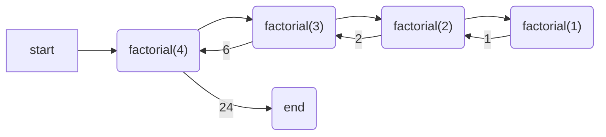

# Module 07 Activity - Recursion 

Recursion is at the heart of **divide**, **conquer**, and **glue**. Why? Because many problems can often be broken up 
into simple cases, and then solving that simple case builds the solution to more complex cases. 

The problem is people often over complicate their point of view, and the solution is to try to force yourself to
think into the simplest terms.  

In this activity, we will cover some base examples of recursion, and then explore more complex example to help
get a better understanding of why recursion.  Recursion is a topic you will continue to come across when working
within computer science, so don't worry if it takes a bit to understand! As a reminder, if you are
struggling you are learning. 


## Factorial
One of the  most common recursive "entry" problem is factorial. A factorial is the product of
integers with all integers smaller than it until 1.

$$5! = 5 * 4 * 3 * 2 * 1$$

However, $5!$ can also be represented as

$$5! = 5 * 4!$$

and $4!$ can be 

$$ 4! = 4 * 3! $$

This means you start to see a **pattern** in the problem. It is 

$$n * (n-1)! $$  

Until $n=1$ which then it just is 1 for the answer!

## Coding Factorial?

We can code a `while` loop for factorial using a counter. 

```python
def factorial_iterative(n: int) -> int:
    counter = 2
    factorial = 1
    while counter <= n:
        factorial *= counter 
        counter += 1
    return factorial 
```

### Task: Write and Document
> **TASK**  
> Write out factorial in a file. Make sure to include a full docstring including examples of input/output. Then
> write test function to test factorial. Question: Did writing a full docstring with examples help you determine the 
> tests to consider? 

#### Advanced  Feature / Discussion 
When you write a docstring with tests, the format is often what you would see if you ran the function in python 
directly. For example:

```python
def factorial_iterative(n: int) -> int:
    """
    description
    
    Examples:
        >>> factorial_iterative(1)
        1
        >>> factorial_iterative(4)
        24
        
    Args:
        n (int): description 
         
    Returns:
        int: describe what is returned
    """
```
 
If you use the above format, this is a command line program you can run that will run the tests in the documentation.

```terminal 
> python -m doctest -v filename.py
```


While using [doctest] isn't required, for *pure* functions (no printing, input, or variable mutation), it saves
time testing as you don't have to write the tests if they are documented in docstrings and doctests is run!

> Install doctest?  
> Depending on your setup, you may need to install the doctest module. You can do this with `pip install doctest`
> or `pip3 install doctest` depending on your setup. pip/pip3 is a package manager for python

## Coding Factorial Recursively 

Recursive functions have **at least two** parts always.  

### Part 1 - Base Case
The first thing you think about with a recursive function is the base or simplest case. For factorial, that is "1" 
or arguably 1 or 0 as $0!$ is defined to be 1. 

You always write the base case first!

```python
def factorial(n: int) -> int:
    if n == 0 or n == 1:
        return 1  # done, exit the function immediately 
```

If I run the above, it works for factorial 0 or factorial 1.

### Part 2 - Recursive Condition

The next part is you consider your recursive condition. Above we defined it as:

$$n! = n * (n-1)!$$

converting that to code we would get

```python
def factorial(n: int) -> int:
    if n == 0 or n == 1:
        return 1  # done, exit the function immediately 
    return n * factorial(n-1)
```

When we run this function, we can "draw it out" by doing the following



Note: start and end are often not included when sketching out function calls like this

> What about negative numbers?  
> An astute group will notice the function breaks on negatives. This is because the base case is not defined for
> negative numbers. You can add a check for negative numbers, but it is strange as factorial for
> a negative is undefined mathematically. In practice, you would want your function to throw a Value or Attribute
> Error. We will explore that in a future module. 

### TASK: Visualize it
As a group use [python tutor](https://pythontutor.com/visualize.html#code=def%20factorial%28n%3A%20int%29%20-%3E%20int%3A%0A%20%20%20%20if%20n%20%3D%3D%200%20or%20n%20%3D%3D%201%3A%0A%20%20%20%20%20%20%20%20return%201%20%20%0A%20%20%20%20return%20n%20*%20factorial%28n-1%29%0A%20%20%20%20%0Afactorial%285%29&cumulative=false&heapPrimitives=nevernest&mode=edit&origin=opt-frontend.js&py=311&rawInputLstJSON=%5B%5D&textReferences=false) to run the recursive function, and see the function stack and how it builds. Run it
with a variety of input, and then try to "draw out" the results on your own. 

## Recursion Looping Through Sequential Data

In python, it is often easier to take a sub-list by using the slice operator. For example, if we wanted to take the
first 3 elements of a list, we could do the following

```python
test = [1, 2, 3, 4, 5, 6, 7, 8, 9]
sub_list = test[:3]
print(sub_list)
```

That same idea can be used when passing in parameters to a recursive function. For example, if we wanted to print
each letter in a word, we could do the following


```python
def print_word(word) :
    print(word)
    if len(word) <= 1:
        return None
    return print_word(word[1:])

print_word("sator arepo tenet opera rotas")
```
(Yes, that is a palindrome, and yes, it is a square!) 

I could even take this idea, and print each letter in a word in reverse order!

```python
def print_word_reverse(word) :
    print(word)
    if len(word) <= 1:
        return None
    return print_word_reverse(word[:-1])

print_word_reverse("sator arepo tenet opera rotas")
```

After trying out the above functions, try this version out:

```python
def print_word_reverse(word) :
    if len(word) <= 1:
        return None
    print_word_reverse(word[:-1])
    print(word)

print_word_reverse("sator arepo tenet opera rotas")
```

What is the difference? Why does it print in reverse order?

### TASK
Write a function that goes from *each end* getting smaller, so the output would be the following

```text
sator arepo tenet opera rotas
ator arepo tenet opera rota
tor arepo tenet opera rot
or arepo tenet opera ro
r arepo tenet opera r
 arepo tenet opera 
arepo tenet opera
repo tenet oper
epo tenet ope
po tenet op
o tenet o
 tenet 
tenet
ene
n
```

Hint: you will want to start with print_word, and then figure out how the slice changes. 

## Building up sequential data with recursion

Items can be returned, so if we wanted to count the number of letters in a word, we could do the following

```python
def count_letters(word) :
    if len(word) <= 1:
        return 1
    return 1 + count_letters(word[1:])
```

Discuss, why does this work? Why do you need to have the return 1?


### TASK
As a team write a function that reverses a word. For example, "hello" would be "olleh". 


## Why Recursion - Deep Dive?

The most common struggle students have learning recursion is the "why". We just showed it can be done with a loop
why do we need to use recursion? However, let's say we wanted to take the product of all values in a list.

```python
def product_values_list(values) -> float:
    rtn = 1.0 
    for i in values:
        rtn *= i 
    return rtn

test = (10, 2.2, 23, 5, 15)
sol = product_values_list(test)
print(sol)
```
Ok... But what if we wanted to add the ability to have more lists or single values in the list?

```python
test = (10, ((1, 2), 4, (13, 2), 10))
```
Seems weird but depending on where you are getting the data, that is possible. Also, there is a very common application we use daily that does this - math! $$(1 + (2 * 3) + (2 / (2+3))* (10+2))$$ You could have any number of parenthesis inside of the other ones!

### Discuss? 
Can you still use a loop to access all the values? If you use `type()` or [`isinstance()`](https://www.w3schools.com/python/ref_func_isinstance.asp) 
it may be possible, but you would have to know exactly how many nested lists. 

Let's make it harder. Let's say you have list of lists each representing a math expression, and you don't know how many you will have. Something like the 
following!

```python
test = (2, "+", ((3, '*', (7, "-", 1)), "/", 2))
```
> If your head is hurting, that is alright! The math above would be
> $$2 + \frac{3 * (7 - 1)}{2}$$
> It just has extra parenthesis to split the expression up.

The above structure is impossible to do with loops, as the number of nested lists is infinite. However, recursively, it is possible, as recursion looks at the simple case and builds up. 

```python
def evaluate_expression(expression):
    if isinstance(expression, int) or isinstance(expression, float):
        return expression # base case
    elif isinstance(expression, tuple):
        left = evaluate_expression(expression[0]) #recursive call
        operator = expression[1]
        right = evaluate_expression(expression[2]) #recursive call
        return do_math(left, operator, right)

def do_math(left, operator, right):
    if operator == "+":
        return left + right
    elif operator == "-":
        return left - right
    elif operator == "*":
        return left * right
    elif operator == "/":
        return left / right # yes this will error if right is 0
    return 0 # default case , not a good idea but works for now. Ideally this should raise an error!


math_expression = (2, "+", ((3, '*', (7, "-", 1)), "/", 2))
result = evaluate_expression(math_expression)
print(f"Result: {result}")
```
The above code can be challenging. We encourage you to run it in [python tutor](https://pythontutor.com/render.html#code=def%20evaluate_expression%28expression%29%3A%0A%20%20%20%20if%20isinstance%28expression,%20int%29%20or%20isinstance%28expression,%20float%29%3A%0A%20%20%20%20%20%20%20%20return%20expression%20%23%20base%20case%0A%20%20%20%20elif%20isinstance%28expression,%20tuple%29%3A%0A%20%20%20%20%20%20%20%20left%20%3D%20evaluate_expression%28expression%5B0%5D%29%20%23recursive%20call%0A%20%20%20%20%20%20%20%20operator%20%3D%20expression%5B1%5D%0A%20%20%20%20%20%20%20%20right%20%3D%20evaluate_expression%28expression%5B2%5D%29%20%23recursive%20call%0A%20%20%20%20%20%20%20%20return%20do_math%28left,%20operator,%20right%29%0A%0Adef%20do_math%28left,%20operator,%20right%29%3A%0A%20%20%20%20if%20operator%20%3D%3D%20%22%2B%22%3A%0A%20%20%20%20%20%20%20%20return%20left%20%2B%20right%0A%20%20%20%20elif%20operator%20%3D%3D%20%22-%22%3A%0A%20%20%20%20%20%20%20%20return%20left%20-%20right%0A%20%20%20%20elif%20operator%20%3D%3D%20%22*%22%3A%0A%20%20%20%20%20%20%20%20return%20left%20*%20right%0A%20%20%20%20elif%20operator%20%3D%3D%20%22/%22%3A%0A%20%20%20%20%20%20%20%20return%20left%20/%20right%20%0A%20%20%20%20return%200%20%0A%0Amath_expression%20%3D%20%282,%20%22%2B%22,%20%28%283,%20'*',%20%287,%20%22-%22,%201%29%29,%20%22/%22,%202%29%29%0Aresult%20%3D%20evaluate_expression%28math_expression%29%0Aprint%28f%22Result%3A%20%7Bresult%7D%22%29&cumulative=false&curInstr=0&heapPrimitives=nevernest&mode=display&origin=opt-frontend.js&py=311&rawInputLstJSON=%5B%5D&textReferences=false) to get a better understanding, but
you do not have to fully understand. You will cover what is known as "recursive data structures" in a later class which is ideal for this type of situation!


### Another Common Case
Flattening a list of lists into a single list is another common case where recursion shines. For example, if we had the following list

```python
test = [1, 2, 3, [4, 5, 6], 7, 8, 9, [10, 11, 12]]
```

We could write a function to flatten it recursively as follows

```python
def flatten(values):
    if not lst:
        return ()
    if isinstance(lst[0], list) or isinstance(lst[0], tuple):
        return flatten(lst[0]) + flatten(lst[1:])
    return lst[:1] + flatten(lst[1:])
```

That's a lot! Go ahead and discuss, but move onto the next part as you are comfortable. Don't worry, this all comes with practice. 

## Setup IDE - VS Code 
For this class, we are setting up [VS Code](https://code.visualstudio.com/Download) for an Integrated Development Environment. You are also free to setup up Pycharm (find the [free student versions](https://www.jetbrains.com/community/education/#students/) or [community version](https://www.jetbrains.com/pycharm/download)). Both are extremely popular IDEs for Python, and it is good to learn them both. As a team, help each other setup up the IDEs on each of your system, and discuss key features. For example, in VS Code, you can right click on a file go to "Run in Interactive Window" and it will run the file in the interactive window. This is a great way to test code quickly, especially if you are working on a function.

After you have completed this task, everyone should take a screenshot of their IDE and post it in the team meeting chat, so we know you have it setup properly!

Bonus, you can use git to download homework 07 from github without leaving either IDE!

## Last Task: Work on Coding-Practice
Go ahead and pick coding practices from Modules 01-06, and work on them. Also, since we have passed the HARD CUT OFF for homeworks 01-05 (note: this may vary semester to semester, so make sure to check). You can now discuss as a group some of your solutions. What did you do differently? What did you do the same?  Did someone do something more effectively than you? Discuss the differences between your solutions.  

Obviously, don't do this with any homework that is still open! You do not want to encourage plagiarism, but code reviews are a very powerful skill to learn. Use this time to practice reviewing code and discussing solutions.


## Submission
There is no "submission" for the Team Activity. Make sure you have your notes for the meeting (can be a doc in the files section) in your team's meeting channel. The TAs will check the attendance logs and award points based on attendance and completed notes.  Make sure to look at [code.py](code.py) for the code examples from this activity, and some other examples of code design (comments, doctest autorun, etc).


[doctest]: https://docs.python.org/3/library/doctest.html
