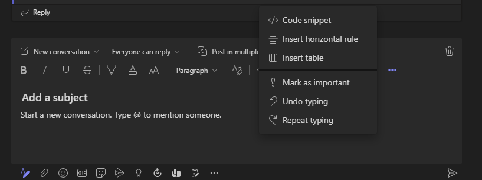
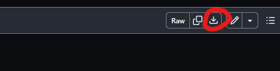

# Homework 1: Welcome to CS5001

First before you start this homework assignment, make sure you complete the syllabus quiz! You won't be able to turn in this homework until you score a 4 of 4 on the quiz. Now let's start. Part of this homework will be auto-graded and parts will be graded via TAs. You will have four points possible for this assignment, each corresponding to a Tier Mastery category (see the syllabus!). It is pretty common to have 3 points with the autograder and the final point being your manually graded point. 

You will be linked template files to use throughout these instructions. You can download them, or if you view the raw code you can copy and past into IDLE saving out the files. Really downloading them to a folder for the assignment, and then opening the files in IDLE is probably the easier path in the long one to prevent accidental copy and paste errors. You can also download this entire repository at once by going to [https://github.com/CS5001-khoury/hw01](https://github.com/CS5001-khoury/hw01) and clicking the green code button, and then 'download zip'. Needless to say, there are a number of ways to get to the templates, and you will slowly develop a workflow that works best for you! 


## Task 0: warm-up - Star Rating App

Use the provided template file called [star_rating.py](../star_rating.py). The file does have logical errors in it, but you should be able to load it fine into IDLE. If you run the file without changes, it should output the following:

```text
1 star rating: 
2 star rating:
3 star rating:
3 star rating:
3 star rating:


My star rating is
Help on function five_star in module __main__:

five_star()
    sets five * to the variable stars.
```

The final solution output should look like

```text
1 star rating: *
2 star rating: **
3 star rating: ***
4 star rating: ****
5 star rating: *****


My star rating is *****


Help on function five_star in module __main__:

five_star()
    sets five * to the variable stars.
```

### Let's get started

You will see a lot of `functions` in the code. While we will cover these later in the course, we separated the warm-up into these functions, so you can think of your code in 'blocks' doing one thing at a time.

> Always make sure to read through all provided code, and express what it does in your own words.  
>     Pros use comments in the code to do that, and not sure yet is  a valid answer!

👉🏽 **Your Tasks**  
1. You should change each function to set the correct number of stars to the variable `stars` 
   * You don't need to modify anything else, just the one line!
   * You should use the string multiplication operator (review the lecture on concatenation)
2. Find the logical errors in the main function, fix them


## ASCII Art

[ASCII art](https://en.wikipedia.org/wiki/ASCII_art) is an age old tradition actually dating back to [printing presses](https://en.wikipedia.org/wiki/ASCII_art#/media/File:Brooklyn-Daily-Eagle-1875-01-06.png). It is the idea of using typography to build pictures out of the characters.  Even  today, emotes start off as simple ASCII art! 

>  ¯\\_(ツ)_/¯

Which is now part of the Emojicon, often translating to 🤷

For the rest of the assignment, you will be working on two pieces of ASCII artwork. 

### Task 1: Hobby Card

Use the file  [hobby_card.py](../hobby_card.py) to start out. You will be building a `string` made up of additional strings. Once again,
review the lecture on concatenation. As a reminder to help you out, you can do something like the following:

```python
card = "This is my line\n"
card = card + "this is my second line"

print(card) # you should not be using print in your hobby_card.py unless it is to debug
```

would print to the screen
```text
This is my line
this is my second line
```

Even better, you can also modify the above to use shortcut assignments to produce the exact same result, but easier to read!

```python
card = "This is my line\n"
card += "this is my second line"

print(card) # you should not be using print in your hobby_card.py unless it is to debug
```

👉🏽 **Task** - Build a card that lists your name and your hobbies. However, you have to meet the following conditions with the card.

1. the total width / length of the card is 32 characters
2. First and last row: 30 dashes (`-`) and a plus (`+`) signs on each corner
2. Each other row uses a bar `|` to start and end
3. The second row will have centered "A Hobby Card" (case matters!)
4. The third row will have your name (as in your actual name, or a nickname if you have a particularly long name)
5. You will have an empty row
6. Followed up by up to three hobbies listed
   1. Indent 4 spaces before your first hobby

Here is a templated example:
```text
+------------------------------+
|         A Hobby Card         |
| Your Name                    |
|                              |
|    hobby1, hobby2, hobby3    |
|                              |
+------------------------------+
```

Along with a finished example:

```text
+------------------------------+
|         A Hobby Card         |
| Albert Lionelle              |
|                              |
|    Fencing, D&D, Writing     |
|                              |
+------------------------------+
```

> **PRO TIP**  
> Run the program frequently as you are building the card. It will be *much* easier to get it correct.  
> Even when writing the solution, we ran the code **every time we created a new line**. 

 
### Task 2:  Get Creative!

👉🏽 **Task**, use the following template file [my_art.py](../my_art.py). Using `print` statements, create some ASCII art! You may want to look at [some examples](https://www.asciiart.eu/). Please note, for part of your turn in, you will be sharing this art with other students!

**IMPORTANT**  
After finishing your hobby card, and ASCII art, go ahead and post the *output* (not the code) to MS Teams.  You should only do this after you have earned 3/4 points using the assignment auto-grader!  To help with formatting, you can (and should) use the </> icon in teams to post the output. Click the A with the pen, and the dots if you don't see it right away.



Even though it says code snippet, when you click on it, you will have the 'text' option which is what you should use. You may have to have the application installed for it to show up as compared to the web version (you should have it installed anyway for this course!). As teams changes, and it is slightly different, do the best you can.


## Task 3: README.md Questions

👉🏽 **Task** Answer the questions in [README.md](../README.md).

In the file [REAME.md](../README.md) there are a number of questions for you to answer. Please make sure to download the file itself, so you can keep the format. 

As a reminder the download button is the top left, after you have clicked on the file in the browser!


To open an `.md` (markdown) file, it needs a simple text editor. You can use IDLE, and when you select open, make sure you enable 'All Files' in the open dialog box when opening and on your first save. You can also use notepad, or notepad++, or many other programs. You will find about halfway through the semester many Integrated Development Environments (IDE) will have support for markdown. The contents of the file are meant to be simple text to read, but you will notice there is some special formatting in the file. This is called markdown, and it is a simple way to format text. You can learn more about markdown [here](https://www.markdownguide.org/basic-syntax/). These instructions were written in markdown. 

For your README.md, you do not need to worry about most the formats! The TAs will read the raw text in the file. However, you should make sure to answer the questions in your own words, and not just copy and paste from the internet. You can use the internet to help you, but make sure to cite your sources. 

As a reminder with the grading system, it is often all or nothing. Meaning if there is a small thing the TA wants you to fix, they will respond with a comment in gradescope making a suggestion on what to fix. 

> **PRO TIP**  
> You are free to ask about these questions in MS Teams chat! They are not meant to be super secret. Don't share your answers, but instead discuss the questions and what they mean - and point towards resources that can help others. 


## 📝 Grading Rubric


1. Learning (AG)
   * each star rating function returns the correct number of stars
2. Approaching  (AG)
   * `main()` function fixed in star_rating.py with proper spacing
3. Meets  (AG)
   * Hobby Card completed with proper formatting
   * my_art.py submitted (graded in exceeds)
4. Exceeds  (MG)
   * Uses `*` concatenation or string  f-formatting for creating stars
   * Properly assigns the variables without additional prints or unneeded assignments
   * Properly updates docstrings in all files
   * Properly answered questions in [README.md](../README.md) 


AG - Auto-graded  
MG - Manually graded

### Submission Reminder 🚨
For manually graded elements, we only guarantee time to submit for a regrade IF you submit by the DUE DATE. Submitting late may mean it isn't possible for the MG to be graded before the AVAILABLE BY DATE, removing any windows for your to resubmit in time. While it will be graded, it is always best to submit by the due date, so you have full opportunity to improve your grade.

## 📚 Additional Resources

* [ASCII Art Examples](https://www.asciiart.eu/)
* [Markdown](https://www.markdownguide.org/basic-syntax/)
* [Github Markdown](https://guides.github.com/features/mastering-markdown/)
* [Python Functions Tutorial](https://www.w3schools.com/python/python_functions.asp) - just the first part

### Functions

Python by default excutes code in the as it sees it. As such, if your file looks like

```python
x = "x"
print(x * 10)
```

It will print `x` 10 times to the screen. However, if you want to reuse code, you can use functions. Functions are a way to group code together, and then call it later. For example, you can do the following:

```python

def print_x_times_10():
    x = "x"
    print(x * 10)


print_x_times_10()
print_x_times_10()
```

Will print `x` 10 times to the screen, twice. One import concept to notice is the "block" required in python. You will see every line after `def` is indented, that means it is part of that function block. You will also see the `print_x_times_10()` is not indented, so it is not part of the function block. 

#### Return Values

You can also return a value with a function. The idea is something that gets repeated, and you get an answer out of it. For example

```python
def get_10_stars():
   return '*' * 10

stars = get_10_stars()
print(stars)
```

Will print

```text
**********
```

The `return` keyword is used to return a value from a function. For now, you just need to focus on making sure your code blocks remain together. In Week 3, we will deal more with functions, and you will find they are often the heart of your programming. Small simple functions can be added together to do amazing things! 