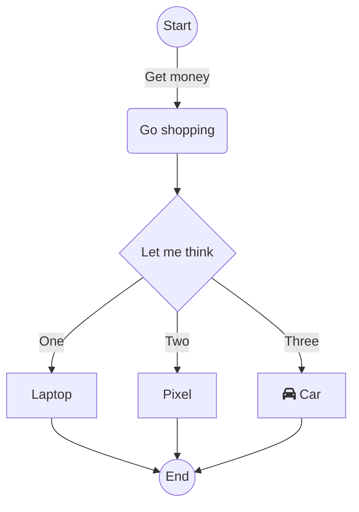

# Homework 02 - Introduction to Logic

For this module, we will explore both variable types, logic and building flowcharts. This homework let's you practice with multiple mini-projects. You may want to read through the entire assignment (including the Additional Resources) before getting started on this one, as there are some tips and tricks that may help you out.

## Star Rating Version 2

For this task, you will explore variable types and client `input()`.  For this task, you will use [star_rating_v2.py](../star_rating_v2.py)

### Part 1: Star Rating  Flowchart

👉🏽 **Task**:  Build a flowchart that maps out the following program. You will submit the flowchart with your code, and you are free to talk about this flowchart. 
However, if you do talk with others on it, make sure their names are included on the flowchart and contribution (e.g. worked in a group).
You should submit the chart as an image either via taking a picture or using a program mentioned in Additional Resources below. 

Your client has asked you to write the following program.

1. Takes in the client's input for both the name of a movie and the number of stars to give it.
2. It will then print to the screen Movie and Stars (*) equal to the number given. 
   * There will be five spaces between name and stars.
3. If someone enters less than 1 star, 1 star is used, if they enter more than 5, five stars are used. 
4. You do not have to worry about the case if the person doesn't enter a number.
5. If they enter a partial number, round down.  (1.5 becomes 1 star)

They have provided the following samples.

```text
Enter a movie: Thor
Rate between 1 and 5: 3
Thor     ***
```

```text
Enter a movie: Princess Bride
Rate between 1 and 5: 5
Princess Bride     *****
```

### Part 2: Write the Program

👉🏽 **Task**: Using your flowchart as a guide, write the program using the template [star_rating_v2.py](../star_rating_v2.py).


## Location Guessing Application

For this task, you will explore variable types, client `input()`, and boolean logic. For this, you will use [temp_guess.py](../temp_guess.py)

You will write an application that suggests a location to live based on conditions.

Given the following chart

| City | High | Low |
| :-- | :--: | :--: |
| Beijing | 33 | -8 |
| Boston | 28 | -7 |
| Honolulu | 32 | 13 |
| San Francisco | 27 | 6 |
| Vancouver | 24  | 2 |

* The client will provide two numbers, a high and low number. 
  * They can be in any order.
* Based on the high and low, will provide recommendations based on locations that fall within the range provided. 
* If a condition can't be met, it will print Unknown. 
 
For example, 
```text
Enter a temperature: 28
Enter a second temperature: -10
Boston
San Francisco
Vancouver
```

```text
Enter a temperature: 12
Enter a second temperature: 35
Honolulu
```

```text
Enter a temperature: 0
Enter a second temperature: 30
San Francisco
Vancouver
```

```text
Enter a temperature: 0
Enter a second temperature: 20
Unknown
```


A flowchart is not required for submission, but it is **highly** recommended you write one! It is also recommended you test as you write to make sure you have the correct signs on your condition checks. 


## README.md

👉🏽 **Task**: Answer the questions in the [README.md](../README.md) file. 

Make sure to answer the questions in the [README.md](../README.md) file. One question will require you to draw a flowchart. You can upload the .png or other file when you submit your homework.

As always you are free to ask about the questions in MS Teams, including clarifications on the code. 


## 📝 Grading Rubric

1. Learning (AG)
   * Star Rating properly takes in input, and works on star between 1 and 5
2. Approaching  (AG)
   * Star rating works on partial star entries, and stars < 1 and > 5
   * Star rating uses proper spacing between movie and stars 
   * Location Guesser provides correct locations based on simple conditions
3. Meets  (AG)
   * Location Guesser provides correct locations when temps are flipped
   * Location Guesser provides correct locations based on harder conditions including edge conditions
   * Code follows recommended style suggestions
4. Exceeds  (MG)
   * Code uses appropriate comments and docstring is updated
   * Code isn't overly complex / meets suggested guidelines for coding
   * README.md questions answered correctly
   * Flowchart is correct
     * matches the code provided 
     * both follow assignment specifications. 


AG - Auto-graded  
MG - Manually graded

### Submission Reminder 🚨
For manually graded elements, we only guarantee time to submit for a regrade IF you submit by the DUE DATE. Submitting late may mean it isn't possible for the MG to be graded before the AVAILABLE BY DATE, removing any windows for your to resubmit in time. While it will be graded, it is always best to submit by the due date, so you have full opportunity to improve your grade.

## 📚 Additional Resources

This section just defines some additional help resources incase you need them

### `input()` 
`input(val)` is a function that requests client input, and returns the value to store in a variable. There are a fair number of resources on it online that are worth looking up. However, a quick reference.

```python
name = input("Enter your name: ")  
```
Notice the parts, between the parenthesis is a prompt that will be printed to the screen. You have to be exact which is why the space is there. The answer to what the client entered needs to be stored in a variable, so thus name gets the answer. From that point on, name is used like any other variable.

```python
## assume someone entered Ada to the prompt
print(f"Welcome, {name}!")
```
Will print 
```text
Welcome, Ada!
```
>Important!  
The thing to watch for with `input()` is that it will **only** return strings! As such, if you want a number, you will need to convert the string to the value using `int(val)` or `float(val)`.


### Drawing flowcharts

You are free to just draw a flowchart on a piece of paper and take a picture. There are a fair number of tools programmers use to draw flowcharts. 

* [LucidChart](https://www.lucidchart.com/) 
* [Draw.io](https://www.draw.io)
* [Visio](https://www.office.com/launch/visio) - which usually costs money, but you have access to it through your NUE office account

However, a more recent trend has been to use [mermaid.js](https://mermaid.js.org/intro/). It is away to use a markdown like language to include mermaid directly into markdown files (like your readme), docstrings, or websites. To make it easier, they have a [live editor](https://mermaid.live/edit)

The following is written in text, and displays as an image thanks to mermaid.


* example pulled from their example with the live editor. 

> Important!  
> If you end up using mermaid, please still include a PNG of your flowchart.   
> Gradescope doesn't automatically show it, and the PNG is what the TAs will grade. There are multiple ways to do that. 
> Using the live editor, you can download the PNG, or there are some command line tools if you feel challenged. 
> 
