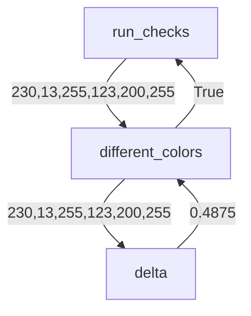
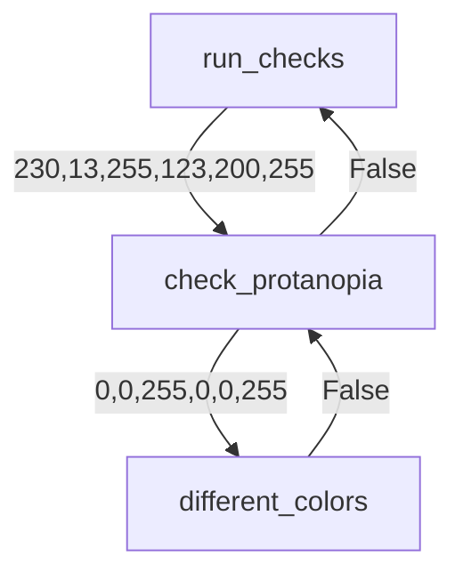
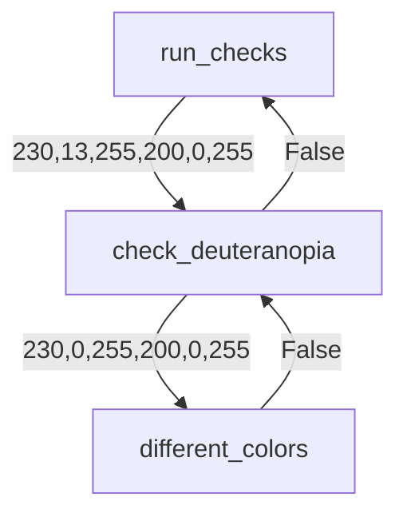
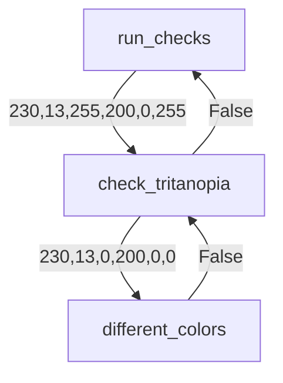
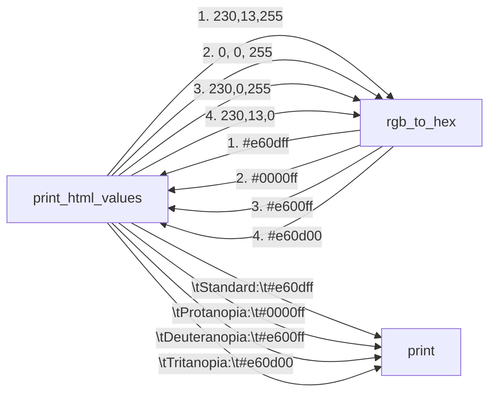
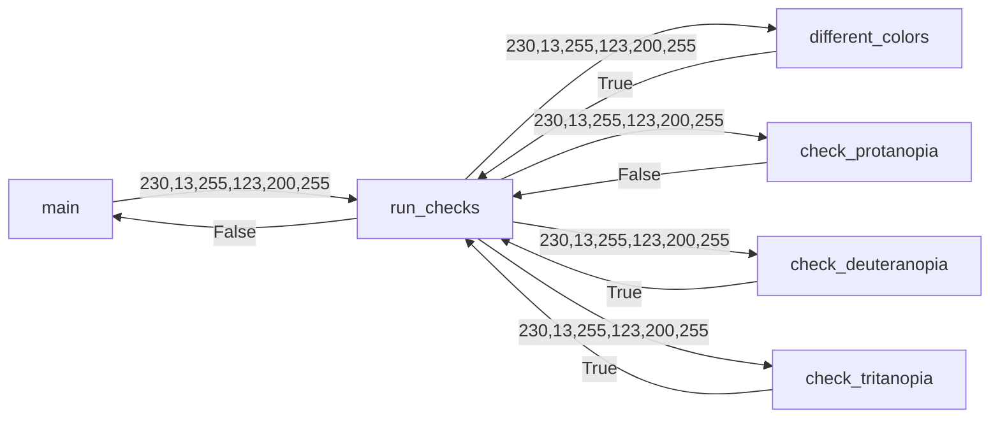
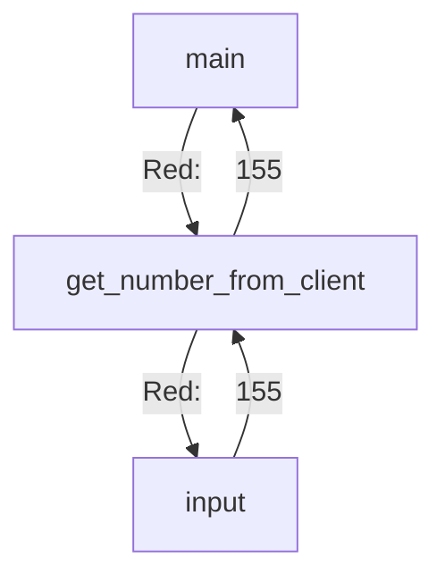

# Color Tester Design Document

The following document loosely presents a design for Color Tester.
Each function presented is required.

## Functions Required
You are required to implement from scratch, including the function call the following functions. You do not 
have to do type hints, but using in the definition so you know what is being passed into each function and 
what type should be returned.

* different_colors(int, int, int, int, int, int) -> bool
* check_protanopia(int, int, int, int, int, int) -> bool
* check_deuteranopia(int, int, int, int, int, int) -> bool
* check_tritanopia(int, int, int, int, int, int) -> bool
* print_html_values(int, int, int) -> None
* run_checks(int, int, int, int, int, int) -> bool
* get_number_from_client(str) -> int
* main() -> None

### Provided functions
The following functions are provided in [color_tester.py](../color_tester.py) and should not be changed.
* rgb_to_hex(int, int, int) -> str - Provided
* delta(int, int, int, int, int, int) -> float - Provided


## Function Definitions

### different_colors

Compares two color RBG values to see how different they are.  Does
not convert, only compares.

#### Args:
* red_one (int): a color range between 0 and 255 representing the red for the first color
* green_one (int): a color range between 0 and 255 representing the green for the first color
* blue_one (int):a color range between 0 and 255 representing the blue for the first color
* red_two (int): a color range between 0 and 255 representing the red for the second color
* green_two (int): a color range between 0 and 255 representing the green for the second color
* blue_two (int): a color range between 0 and 255 representing the blue for the second color

#### Returns:
True if the difference defined by `delta` is greater than `MIN_DIFFERENCE`

#### Flow Diagram:
Assume the client entered the colors (230,13,255) and (123,200,255), eventually main will call run_checks, which will then call different_colors
with those values to compare them without a color blindness filter. 




### check_protanopia
Compares two RBG values checking to see if when the colors are seen
by someone with protanopia, they are to similar. 

> Protanopia is when there is 0 red and greens and only blues, so
> when comparing, all colors become their blue value only. 


#### Args
* red_one (int): a color range between 0 and 255 representing the red for the first color
* green_one (int): a color range between 0 and 255 representing the green for the first color
* blue_one (int):a color range between 0 and 255 representing the blue for the first color
* red_two (int): a color range between 0 and 255 representing the red for the second color
* green_two (int): a color range between 0 and 255 representing the green for the second color
* blue_two (int): a color range between 0 and 255 representing the blue for the second color

#### Returns
boolean: returns true if the colors are too similar when someone has protanopia

#### Flow Diagram
Assume the client entered the colors (230,13,255) and (123,200,255), eventually main will call run_checks, which will then call check_protanopia
with those values. 



### check_deuteranopia

Follows the same design as check_protanopia, but instead
of checking for protanopia checks colors with 
deuteranopia. 

#### Args
* red_one (int): a color range between 0 and 255 representing the red for the first color
* green_one (int): a color range between 0 and 255 representing the green for the first color
* blue_one (int):a color range between 0 and 255 representing the blue for the first color
* red_two (int): a color range between 0 and 255 representing the red for the second color
* green_two (int): a color range between 0 and 255 representing the green for the second color
* blue_two (int): a color range between 0 and 255 representing the blue for the second color

#### Returns
boolean: returns true if the colors are too similar when someone has deuteranopia.

> Deuteranopia: Defined as when someone looses all greens in an RGB value scheme


#### Flow Diagram
Assume the client entered the colors (230,13,255) and (200,200,255), eventually main will call run_checks, which will then call check_deuteranopia with those values. 



### check_tritanopia
Follows the same design as check_protanopia, but instead
of checking for protanopia checks colors with 
tritanopia. 

> Tritanopia is when someone sees only red and green values of an RGB color scheme.

#### Args
* red_one (int): a color range between 0 and 255 representing the red for the first color
* green_one (int): a color range between 0 and 255 representing the green for the first color
* blue_one (int):a color range between 0 and 255 representing the blue for the first color
* red_two (int): a color range between 0 and 255 representing the red for the second color
* green_two (int): a color range between 0 and 255 representing the green for the second color
* blue_two (int): a color range between 0 and 255 representing the blue for the second color

#### Returns
boolean: returns true if the colors are too similar when someone has tritanopia


#### Flow Diagram
Assume the client entered the colors (230,13,255) and (200,200,255), eventually main will call run_checks, which will then call check_deuteranopia with those values. 



### print_html_values
Prints out the html values of each color as the standard
color scheme, and the three color blind filters applied.

For example if `print_html_values(230,13,255)` is called,
will print out. 

```
	Standard:   #e60dff
	Protanopia: #0000ff
	Deuteranopia:	#e600ff
	Tritanopia: #e60d00
```

The spacing before the word and after are `\t` characters, so your
spacing may vary. 

#### Args
* red (int): red color value
* green (int): green color value
* blue (int): blue color value

#### Flow Diagram
Using the example above with (230,13,255) the flow diagram could be.



1., 2., 3., 4. represent paired function calls and returns since rgb_to_hex is called four times at a minimum. The `None` return for `print` is not
shown for simplicity. 


### run_checks

Checks to see if there is a difference between two colors
for standard vision, Protanopia, Deuteranopia, Tritanopia. Will
print out if there is a difference or not before
returning the result. 

For example, if the following is called
```run_checks(230, 13,255, 123,200,255)``` it will
print.

```
Normal vision:  Different
Protanopia:  Too similar
Deuteranopia:  Different
Tritanopia:  Different
```
and then return `False`. Only a single space is used between words, and no
indent. 

#### Args:
* red_one (int): a color range between 0 and 255 representing the red for the first color
* green_one (int): a color range between 0 and 255 representing the green for the first color
* blue_one (int):a color range between 0 and 255 representing the blue for the first color
* red_two (int): a color range between 0 and 255 representing the red for the second color
* green_two (int): a color range between 0 and 255 representing the green for the second color
* blue_two (int): a color range between 0 and 255 representing the blue for the second color


#### Returns:
bool: True if every color is different under all vision types, but False if only one vision type the colors are too similar.


#### Flow Diagram
Using the example above with (230, 13,255) as the first color and (123,200,255) as the second color the flow diagram could be.


 Important! Calls to print are left out for simplicity of the diagram! See
 example run to see how it will print. 


### get_number_from_client

Gets a number from a client using input.

#### Example

If someone calls `get_number_from_client` with the argument of "Red:". The
client will be prompted "Red:". In this case, they will enter 155, and it will simply return 155.

HOWEVER if the client enters a value greater than 255 or less than 0, 
it will prompt them by saying

```text
--Invalid number. Must be between 0 and 255--
```
It will then call `get_number_from_client` again, with the same
argument, and return the result from the additional call. 

> Protip - get the function working without error checking, complete the
> program and then fix the error checking (just because this is probably
> the hardest part of this design). If you know about loops, you *should not* use one for this function. It can be done without using for or while. 


#### Args
* msg (str): a string for the message to print as part of the `input(msg)` call

#### Returns 
int: a number between 0 and 255. If a number outside that range 
is entered, it will prompt the user to reenter until the range
is valid. Does not check for invalid numbers, just range!  

> Notice it returns an int value! You will need to cast!

#### Flow Diagram

Basic run



A more complicated run

```mermaid
flowchart TD
    main -- Red: --> get_number_from_client
    get_number_from_client -- 1. Red: --> input
    input -- 1. 300 --> get_number_from_client
    get_number_from_client -- --Invalid number. Must be between 0 and 255-- --> print
    get_number_from_client -- Red: --> get_number_from_client
    get_number_from_client -- 2. Red: --> input
    input -- 2. 155 --> get_number_from_client
    get_number_from_client -- 155 --> main
```


### `main`

The main driver of the program. Will print a welcoming, then
prompt the client to enter red, green, and blue values 
for one color, and then red, blue, and green for a second color. 

It will then print the HTML values for color 1 with the colorblind filters
applied, and the HTML values for Color 2 with the colorblind filters
applied using `print_html_values`.

It will then call `run_checks` to print if the colors are different given
the colorblind filters, followed by stating the colors are `different`
or `too similar` using the return value of `run_checks` before
ending the program. 

#### Example:

Assume the client enters (230, 13,255) for the first color, and (123,200,255) for the second color.
```text
Welcome to color checker.
Enter the RGB values for two colors.
Enter your first color:
Red: 230
Green: 13
Blue: 255
Enter your second color:
Red: 123
Green: 200
Blue: 255
The HTML values for the Color 1 are: 
	Standard:   #e60dff
	Protanopia: #0000ff
	Deuteranopia:   #e600ff
	Tritanopia: #e60d00
The HTML values for the Color 2 are: 
	Standard:	 #7bc8ff
	Protanopia:	 #0000ff
	Deuteranopia:	 #7b00ff
	Tritanopia:	 #7bc800
Normal vision:  Different
Protanopia:  Too similar
Deuteranopia:  Different
Tritanopia:  Different
The colors are too similar.
```

## Design Suggestions

This is the type of application that it helps to build from the "inside" out. Two functions are already given to you. `delta(int,int,int,int,int,int)` and `rgb_to_hex(int,int,int)`. You should use these methods to build the other methods.

For example, you could build `different_colors` first, and then use that to build `check_protanopia`, `check_deuteranopia`, and `check_tritanopia`. Or you could start with print_html_values, and partially work on the main, and go back and forth.

The former method is easier, and actually more like how you would build a large program. The reason being is after you write each function, you can test it. If you write `different_colors` first, you can test it by writing a test function that calls `different_colors` with different values. You can then write `check_protanopia` and test it by calling `check_protanopia` with different values.

[test_color_tester.py](../test_color_tester.py) is a file that you can add your tests to. You should use the provided test as an idea for a template.

> You do not have to write unit tests `print_html_values` or `main`. Both these functions return `None` and only
> print to the screen. As such, those tests will be done by running the program with different inputs and 
> double checking the results. With that said. You can write tests for them if you want, and you will want to explore how to capture the stdout context. This is a much more advanced technique that we won't cover in this course, but comes up more in 5004.  


Make sure to test all functions that return a value with a variety of inputs BEFORE you submit to gradescope. 