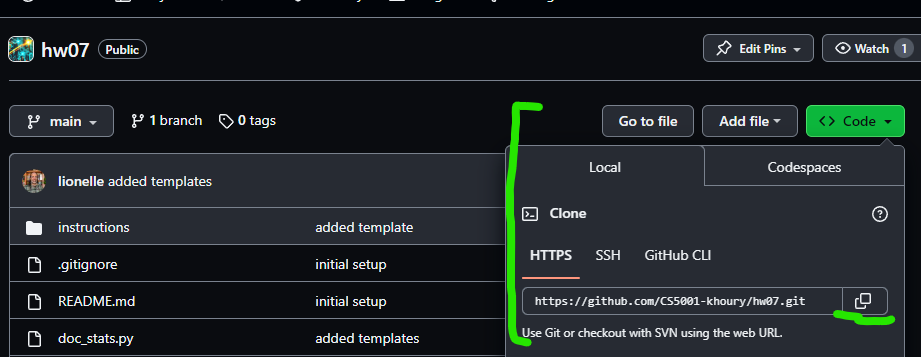

# Homework 07 - Recursion and For Loops

For this homework you will be focusing on recursion and for loops. Additionally, you will explore how projects are often made up of many files, each file (known as a module in python) containing functions that are related to each other in some way. 

## Provided Code and Files
For this assignment, there are four files provided to you.
* [doc_stats.py](../doc_stats.py) - this is the main "driver" of the program. In fact, it's only purpose is to run this particular program. All code is provided, no need to edit. 
* [doc_view.py](../doc_view.py) - this file contains all the interaction with the client (print and input). The "view" is often used in a lot of design paradigms, as the layer that interacts with the client. By containing your interaction to the view layer, it is easier to swap out the different modalities in which one interacts (console, websites, mobile apps, VR, etc) without having to modify the entire program. All code is provided, no need to edit.
* [word_lib.py](../word_lib.py) - This file contains three functions that gives you information about a word. The function signatures (def, and docstring) are provided, but you will need to implement the function bodies. While they can be implemented with loops, we are asking you to implement them recursively to practice recursion.
* [doc_stats_builder.py](../doc_stats_builder.py) - This file contains the function that builds various statistics about a "document" (a documents is a list of text strings). The function signatures (def, and docstring) are provided, but you will need to implement the function bodies. In this case, for-in loops are the best way to implement these functions, and we are encouraging you to use them to practice for-in loops. 

While it is optional, you may want to consider using Git to copy the code to your computer. See the [Resources](#using-git-to-copy-the-code) section for more information. Throughout the rest of the semester are going to build up to you using github, as that is the standard for later courses and the industry standard. Right now, it is optional! 

> IMPORTANT  
> Make sure to read through all the files. Looking at the imports, get a sense of how they all interact together. 
> Ask questions on teams if you are unsure how the files interact together!

# Part 1: word_lib.py

👉🏽 **Task**: Implement the three functions in [word_lib.py](../word_lib.py) recursively.

The three functions listed in word_lib.py are about looking at a string (technically does not have to be a single word..). While each one can be implemented using a loops, we are asking you to implement them recursively. This is a case of practice makes perfect, and recursion is a topic that takes a lot of practice to get used to. Make sure to take a look at your Team Activity for the module and the provided code. We intentionally built in similar activities, so you can practice the same concepts in a different context.

> Docstring Examples  
> Pay particular attention to the docstring examples. Arguably, these are NOT complete, so you may
> want to add some other examples using the same format to help you understand the edge cases. (see [Testing](#testing))

# Part 2: doc_stats_builder.py

👉🏽 **Task**: Implement the three functions in [doc_stats_builder.py](../doc_stats_builder.py) using for-in loops.

Each function in doc_stats_builder.py is about building a statistic about a document. If you read the doc_view.py file, you will notice a document is being built from a client typing multiple lines in a console. It then returns a tuple of strings, where each string is a line of the document. That means for each function, you can assume a document will look like this:

```python
doc = ("This is the first line",
       "This is the second line",
       "This is the third line",
       "This is the fourth line",
       "This is the fifth line")

line_count = len(doc) # 5
print(f"Line count: {line_count}")
counter = 0
for line in doc:
    print(counter, line) # prints every line of the document to the screen, with a counter in front of it
    counter += 1
```
The output would be

```text
Line count: 5
0 This is the first line
1 This is the second line
2 This is the third line
3 This is the fourth line
4 This is the fifth line
```

Remember, you can grab individual words from a string using the same syntax as a list. For example:

```python
line = "Aloha! World"

for word in line.split(): #splits via spaces/whitespace, returns a list of words
    print(word)
```
prints: 

```text
Aloha!
World
```

Hint: for some functions you are looking at lines, others you are looking at words within each line, so a nested loop may be needed.

Hint2: Make use of your three functions you wrote in word_lib.py!

## Testing
In general, you always want to test functions individually and then everything working together as a group (called interaction testing). You will notice, that in [doc_stats_builder.py](../doc_stats_builder.py) and [word_lib.py](../word_lib.py) there are docstring examples. These are examples of how the function should work. You can use these as a starting point for your testing. Also, if you have doctest installed, you can run the doctests in the docstrings just by executing the file. See the resources for doctest. However, the examples are not complete (they don't test edge cases). You should add additional examples to the docstrings to help you test your code.

For testing, you just have to provide documentation that you tested. This can be done in two ways:

1. Write your tests like you have in the past assignments adding the files to the project (for example, you create a file called word_lib_tests.py, and add tests in there).
2. Update the examples, run doctest, and save the full output to a text file indicating your tests passed.

Either way, you should submit your tests with your code. 

### Integration Testing
Integration testing is testing how the functions work together. In this case, you can use the doc_stats.py file to test how the functions work together. This actually executes the program, which you can run with various examples,and then save the output of the runs to make sure they are working! 


# Part 3: README.md

👉🏽 **Task**: Answer the questions in the [README.md](../README.md) file. 

Make sure to answer the questions in the [README.md](../README.md) file.

As always you are free to ask about the questions in MS Teams, including clarifications on the code. 

## 📝 Grading Rubric

For this assignment, you will submit:
* word_lib.py
* doc_stats_builder.py
* README.md
* Any test files you created including output captured from running the tests and your final program run.
  * Basically, you are proving you tested it, and it works as expected! :) 

While we provide tests, reminder, you should test your own code before submitting!

1. Learning (AG)
   * word_lib - palindrome works on easy conditions
   * word_lib - count vowels works on easy conditions
   * word_lib - clean_word works on easy cases
2. Approaching  (AG)
   * word_lib - palindrome works on edge cases
   * word_lib - count vowels works on edge cases
   * word_lib - clean_word works on edge cases
   * doc_stats_builder - line_count works
   * doc_stats_builder - word_count works
3. Meets  (AG)
   * doc_stats_builder - vowel_count works
   * doc_stats_builder - word palindromes works
   * doc_stats_builder - sentence palindromes works
4. Exceeds  (MG)
   * README.md questions answered
   * Proper comments and docstrings throughout code
   * Uses Recursion for word_lib, and for-in loops for doc_stats_builder
   * Test files provided / evidence of testing and running the program
  

AG - Auto-graded  
MG - Manually graded


### Submission Reminder 🚨
For manually graded elements, we only guarantee time to submit for a regrade IF you submit by the DUE DATE. Submitting late may mean it isn't possible for the MG to be graded before the AVAILABLE BY DATE, removing any windows for your to resubmit in time. While it will be graded, it is always best to submit by the due date, so you have full opportunity to improve your grade.

## 📚 Resources
* [Python Recursion](https://realpython.com/python-thinking-recursively/)
* [Python For Loops](https://realpython.com/python-for-loop/)
* [Python Doctest](https://docs.python.org/3/library/doctest.html)
* [Python Doctest Tutorial](https://pymotw.com/3/doctest/)
* [Python Doctest Tutorial 2](https://realpython.com/python-doctest/)
* [Getting Started with Git](https://docs.github.com/en/get-started/getting-started-with-git) - note: you can clone a repo without all the features of git, so don't worry so much on this just yet. 
  
### Using Git To Copy The Code

Did you know it is possible to "clone" the entire git repository to your computer? This is a great way to get the code, and then you can use VS Code or PyCharm to edit the files.

First you will need to make sure git is installed on your computer, though often the installs for VS Code and PyCharm adds their own git version. If for some reason they didn't, you can install git here: https://git-scm.com/downloads

To clone using VS Code, open a new window and click "Clone Git Repository" and paste in the URL from the "Code" button on the [main page](../) of the repository. 



The button to find the repository URL is the green code button. 


If you have VS Code, for PyCharm it is "GET FROM VCS" in the new project window.


Just because the dialog is easy to  miss. 

Doing this will copy the entire repo including instructions to your local machine! You will find there are multiple extensions you may want to install as you use them. Feel free to discuss them in teams Tips, Tricks, and Resources!